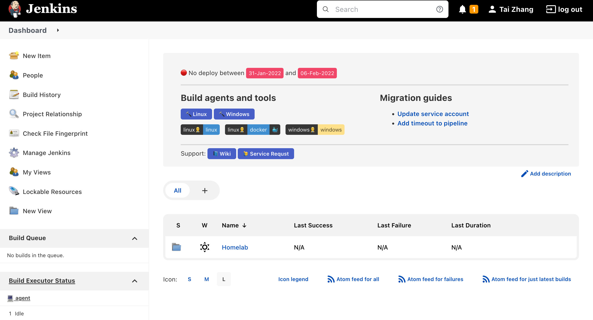

# jenkins-awesome-banner



Jenkins [Markup Formatters](https://www.jenkins.io/doc/book/security/markup-formatter/#configuring-the-markup-formatter) only support plain text and safe html option for redering system messages(banner), this tools will let you define complex elements and use them in special markup formatter in your message. [Simple Theme](https://plugins.jenkins.io/simple-theme-plugin/) plugin is required.

There are some minimium css styles defined in `style.css` file are copied from [bulma](https://github.com/jgthms/bulma), you can add or customize as you need.

## Setup

1. Copy the `script.js` and `style.js` files into `$JENKINS_HOME/userContent` folder.
1. In the `Configure` page of Jenkins, go to `Theme` section, add:

  - **CSS URL**: https://jenkins.example.com/userContent/style.css
  - **JavaScript URL**: https://jenkins.example.com/userContent/script.js

## Usage

### Attributes

At the beginning of tag, add `{: <attrs> }`, e.g. below example will add 3 classes to the `a` tag.

Only support class name and id name.

```html
<a href="#">{: .button .is-link .is-small }🔨 Linux</a>
```

### Custom Element

As of now there is only one type of custome element: `tag-addons-group`, copied from [this bulma example](https://bulma.io/documentation/elements/tag/#tag-addons)

You need to create a div starts with `[[ <custom-element-name> ]]`, and the rest text will be treated as params to create this element, in this example "|" is the separator of each group, ":" is the separator of each tag. `{.is-dark}` is a class attribute. Since this custom element already defind each child as tag so you don't need to add `{.tag}` attribute.

```html
<div>[[ tag-addons-group ]] {.is-dark}linux👷‍♂️:{.is-info}linux|{.is-dark}linux👷‍♂️:{.is-info}docker:{.is-dark}🐳|{.is-dark}windows👷‍♂️:{.is-warning}windows</div>
```
